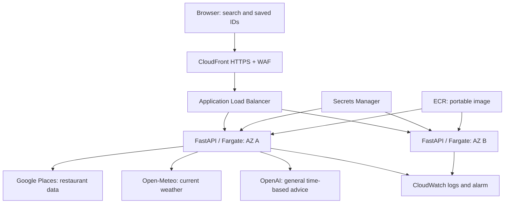

# Architecture and rationale

## Problem and users

A Berlin resident or visitor has a restaurant in mind but must switch between search, opening times and planning advice. BerlinBite combines the smallest useful flow: search, identify, inspect, decide, save. Persona: an English-speaking visitor planning dinner with a friend. User story: “I want to confirm the restaurant and understand what is known before I travel there.”

## Data flow

Both tasks perform the same provider calls. CloudFront-to-ALB and ALB-to-task are HTTP in this draft; the external API calls are HTTPS. See deployment limitations.

## Alternatives

| Choice | Benefit | Tradeoff / why not chosen |
|---|---|---|
| FastAPI in Docker | Portable standard ASGI app, testable routes | Must operate a container service |
| Lambda | Can reduce idle compute expense | Runtime adapter and request duration/cold-start considerations |
| App Runner | Simple container hosting | Closed to new customers; not safe to assume availability |
| ECS Express Mode | Managed defaults and HTTPS | Standard ECS selected for explicit academic infrastructure visibility; revisit if delivery speed dominates |
| ECS Fargate + ALB + CloudFront | Explicit scaling/networking and default HTTPS viewer URL | More resources and higher baseline expense |
| S3 frontend | Static asset offload | Separate deployment surface; not needed for this small frontend |
| Database | Cross-device saved lists | Accounts, privacy and operational overhead outside MVP |
| Browser place-ID list | Minimal storage and no content cache | No cross-device sync; labels fetched on open |

## Reliability and best practices

Two availability zones, two baseline tasks, health checks, deployment rollback and CPU autoscaling are defined. External provider failures are caught and shown with safe errors. Search failure blocks real restaurant results. Weather and AI failure degrade independently. No success is claimed until the deployment and failure paths are exercised.

## Security and observability

Secrets are backend-only and excluded from source/image archives. Execution IAM role reads only the two project secrets. No application task role is granted broad AWS access. Input lengths and place IDs are validated. UI renders provider strings with `textContent`, external links allow HTTPS, CSP blocks third-party scripts and framing, and API responses are not cached. WAF and local request limits offer layered abuse protection. Logs should not contain API credentials or provider response dumps.

## Scientific limits

The crowd score is not trained, evaluated against occupancy, calibrated as a probability, or based on live crowd data. It is an explicit prototype heuristic. The tutor's ML-oriented framing can be discussed as future work: collect consented/appropriately licensed observations, define occupancy labels, split by restaurant/time to avoid leakage, compare against the time baseline and measure error/calibration before claiming predictive value.

## AI-use disclosure

Code and documentation were drafted with OpenAI Codex assistance. The student must inspect, test and explain the result and follow current institutional disclosure rules. No tutor feedback, real deployment evidence or model evaluation has been invented.
